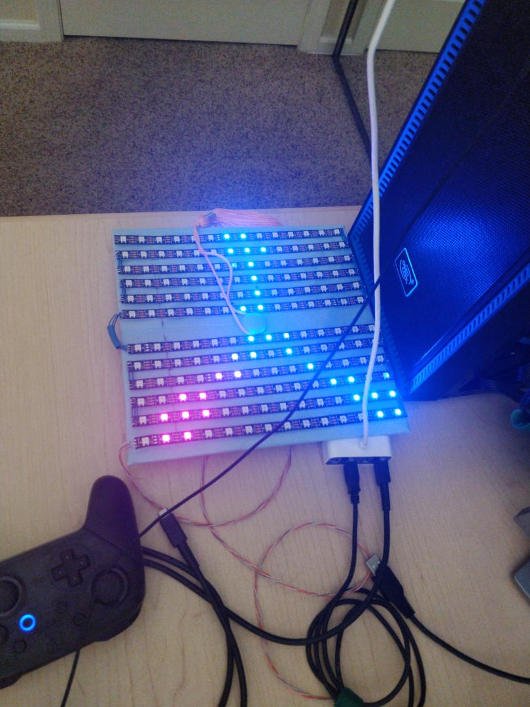
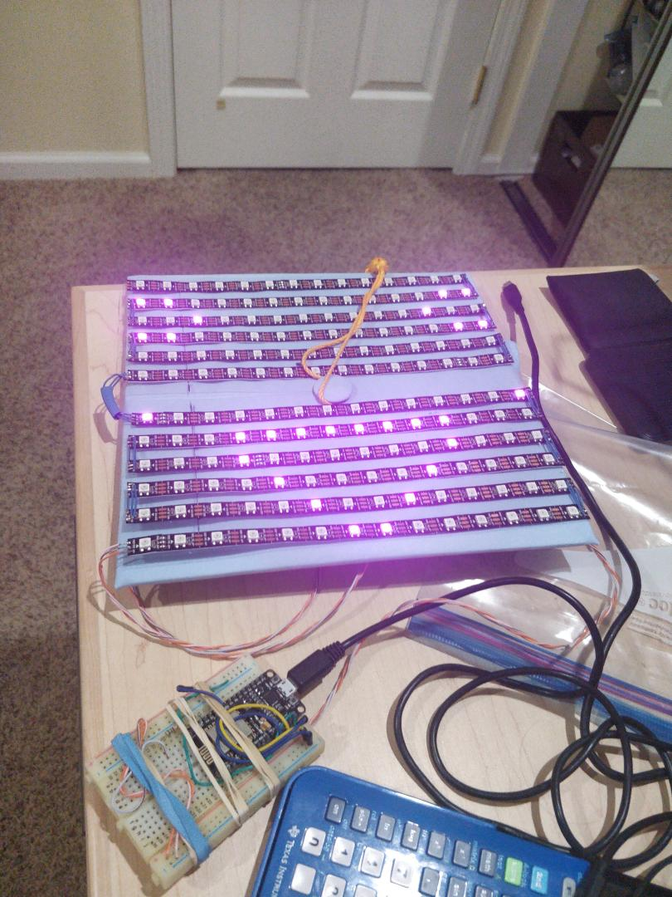
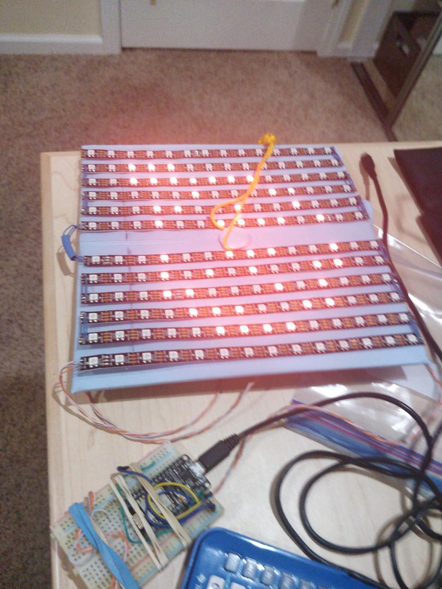
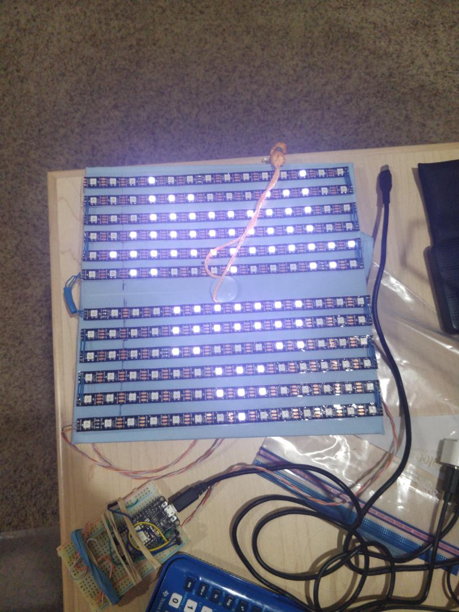

# Boushi


## A 2D Array of LEDs on a graduation cap
Alright since I was dumb and didn't plan correctly, I never actually got to use this during graduation. Administration took our phones for the ceremony which sucks as I thought I would never be let in with the hat but then one of my friends walked in with an Apple Watch so I probably was able to. Not that it would've mattered anyway because the LEDs were too dark to see in direct sunlight.

# Showcase







## It can play gifs as well!

# How it works

The project only uses 2 main components

- [WS2812B Individually Addressable LED Strips ($30 for 16.4 ft)](https://www.amazon.com/BTF-LIGHTING-Flexible-Individually-Addressable-Non-waterproof/dp/B01CDTEJBG)
- [An ESP8266 based NodeMCU Dev Board ($5)](https://www.amazon.com/KeeYees-Internet-Development-Wireless-Compatible/dp/B07PR9T5R5/ref=sr_1_18?dchild=1&keywords=nodemcu&qid=1629235422&sr=8-18)

It is controlled by a WebUI written in Svelte and images can be added to to the hat by either drawing them in the WebUI or adding them to the `img` folder and having the custom Go program convert them to FastLED instructions

## This is **HIGHLY** not user friendly to build and was built for personal use, but if you want to try to get it to work, have fun!

# How to Build (Software)

## 1. Clone the Repo
```bash
git clone https://github.com/ninjawarrior1337/boushi.git
```

## 2. Build the WebUI
```bash
cd web
npm i && npm run build
```
This will automatically put the bundled web assets into `/data` so that platformio can put these files into LittleFS when uploading the microcontroller program

## 3. Add images
You need to put all the images you want into `img` and then run the conversion script by running
```bash
cd converter
go run .
```
NOTE: This will assume that your hat is 14 wide x 12 tall. If you want to change this, add flags like so

`go run . -w <width> -h <height>`

This will generate an art.h file in src, **this file is required to build the microcontroller program** so **please run the go program regardless of if you have images** (you probably will so I wouldn't worry about this too much)
##  3. Build the microcontroller program
Use PlatformIO to build and upload the program for the microcontroller. The build has two targets.

Use `DEV` if you are planning to control the hat via an already established WiFI network

Use `PROD` if you are planning to control the hat via its own WiFi network.

### 3.1 Creating `creds.h`

Regardless of which target you choose, you need to have a `creds.h` file in `src`. Here is a template that you can copy, paste, and edit with your specific values.

WIFI_SSID and WIFI_PW are both used with the `DEV` target

LOCK_PW is to prevent people from changing what is on the hat.

```c
#ifndef CREDENTIALS_H
#define CREDENTIALS_H

#define WIFI_SSID "wifi_ssid_here"
#define WIFI_PW "wifi_pw_here"
#define LOCK_PW "lockpw"

#endif
```

Get PlatformIO to build, upload, and uploadfs and depending on which target you chose, there is either a webserver running on some IP address on your network or there is a new open WiFi network called `Boushi` and the WebUI can be accessed by visiting `21.21.21.21` on anything connected to it.

# How to Build (Hardware)

Alright so uhhhh, I'm kinda too lazy to write this part... All im going to say is just connect the data pin on the LED strip to D2 on the NodeMCU and the negative and positive pins to something that won't blow up your LED strips. Also note that **pixels are drawn from in the order of left to right, bottom to top in a zig zag pattern** and that is how all the software is written in mind of so be weary of that if you construct your own. 

Basically the wiring should look like this
```
---------E
|---------
---------|
|---------
S--------|
```
Where:
```
S is the start
E is the end
Each - is an LED
Each | is a connection point to the next row up.
```

# Hmmmm
Hopefully I'll make the pack that controls the hat embedded into the hat for v2....
